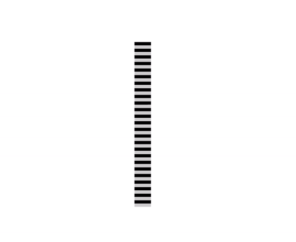

In mathematics, physics, and art, moiré patterns or moiré fringes are large-scale interference patterns that can be produced when an opaque ruled pattern with transparent gaps is overlaid on another similar pattern.
